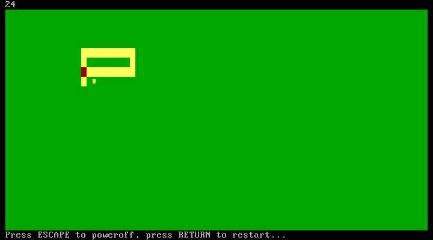
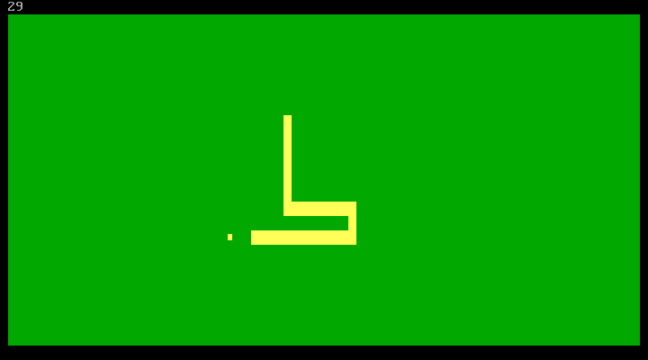
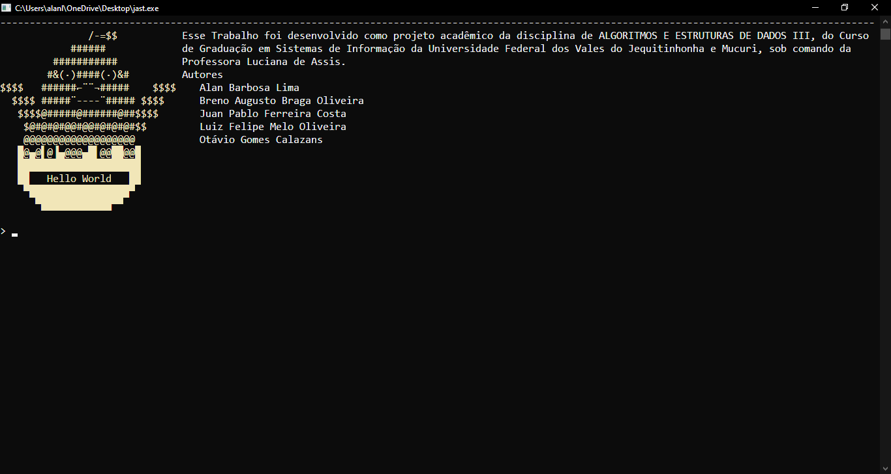
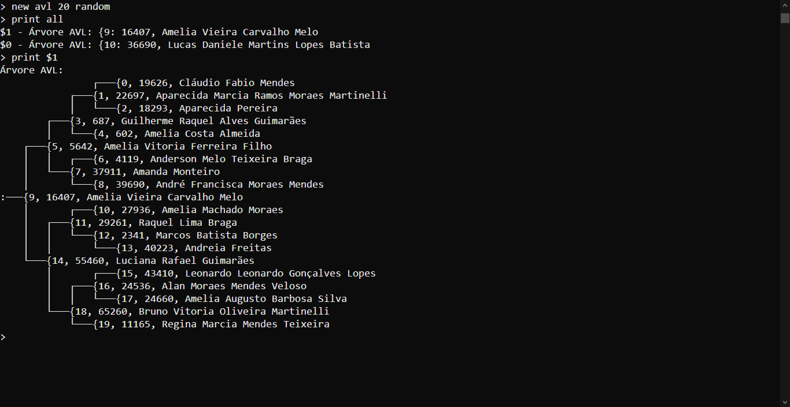
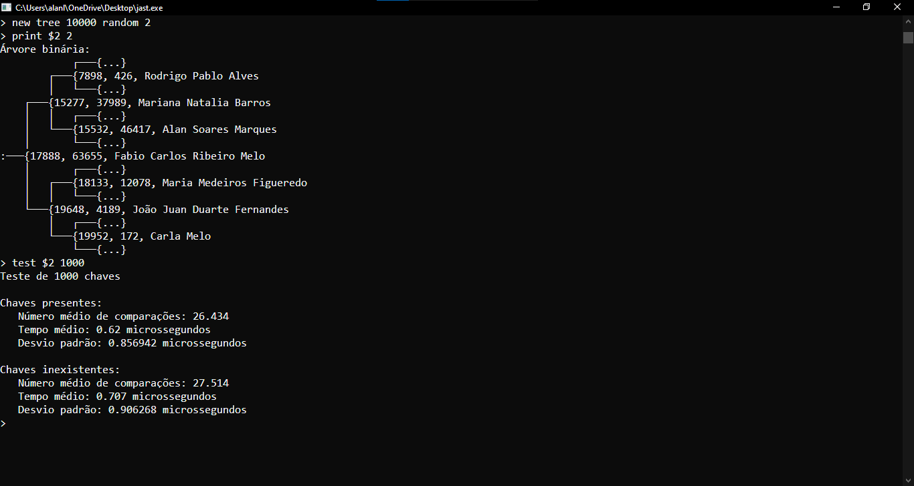

# Projects

## Snake Game

[GitHub Repository](https://github.com/AlanLima287/snake)

This is a small project featuring the classic Snake Game (or just Snake), developed in x86 Assembly.

### Tecnologies Used

- x86 Assembly
- [QEMU](https://www.qemu.org)

### Sample Images

## JAST

[GitHub Repository](https://github.com/AlanLima287/Binary_Tree)

This is a academic project associated with the discipline of Data Structures and Algoritms III. It consists of a terminal aplication and interpreter that interact with three classes of Data Structures:
- Linked Lists;
- Binary Trees;
- AVL Trees;
The project features functionalities like creation and test of such strutures. Furthermore, the project carries all the theory behind its innerworking and algorithm implementation.

### Tecnologies Used

- C++

### Sample Images

